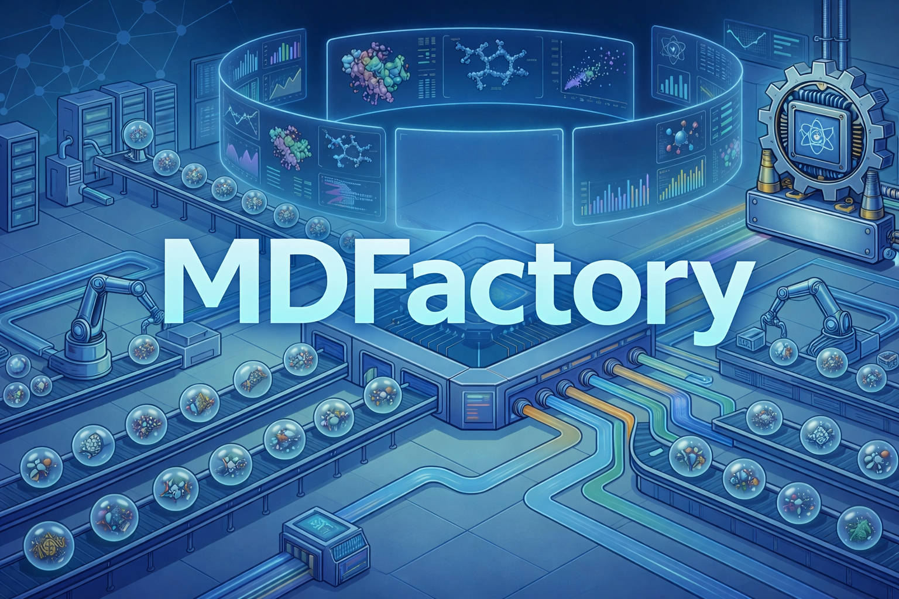

<p align="center">
  
</p>

<p align="center">
  <a href="https://github.com/emdgroup/mdfactory/actions/workflows/ci.yml?query=branch%3Amain"></a>
  <a href="https://github.com/emdgroup/mdfactory/actions/workflows/docs.yml?query=branch%3Amain"></a>
  <a href="https://github.com/emdgroup/mdfactory/issues/"></a>
  <a href="https://github.com/emdgroup/mdfactory/pulls/"></a>
  <a href="https://github.com/emdgroup/mdfactory/blob/main/LICENSE"></a>
</p>

# MDFactory

MDFactory is a high-throughput library for setting up molecular dynamics (MD) simulations. It provides a flexible and efficient framework for creating, parameterizing, and running MD simulations across various systems and engines.

## Features

- **System building** — Mixedbox, bilayer, and LNP build types from YAML or CSV input
- **Parametrization** — OpenFF/SMIRNOFF and CGenFF with automatic per-molecule caching
- **Batch processing** — CSV-driven Nextflow pipelines for parallel builds and GROMACS runs on HPC
- **Analysis** — Registered analysis and artifact types with parquet output, local or SLURM execution
- **Data integration** — Push/pull/sync across SQLite, CSV, and Palantir Foundry backends

## Installation

### Using pixi (recommended)

[pixi](https://pixi.sh) manages both conda and pip dependencies in a single tool.
All conda-forge-only packages (rdkit, openff-\*, openmm) are declared
in `pyproject.toml` under `[tool.pixi.*]`.

```bash
git clone https://github.com/emdgroup/mdfactory.git
cd mdfactory
pixi install          # creates the environment and installs everything
pixi run mdfactory    # run the CLI
pixi run -e dev test  # run the test suite
```

### Without pixi

Create a conda environment with the conda-forge-only packages first, then pip-install the project:

```bash
conda create -n mdfactory -c conda-forge python rdkit \
    openff-toolkit openff-interchange openff-nagl openff-units openmm
conda activate mdfactory
pip install -e .[dev]
```

## Documentation

We ship an auto-generated documentation site under `docs/` powered by Next.js and Fumadocs. It combines hand-written guides with API pages produced from the Python package using `fumadocs-python`.

1. Install the tooling:
   ```bash
   cd docs
   bun install
   python3.11 -m pip install -e ..
   python3.11 -m pip install ./node_modules/fumadocs-python
   ```
2. Generate docs + run the dev server (this command automatically rebuilds the API docs on every run):
   ```bash
   bun run dev
   ```

Use `bun run docs:generate` if you only need to refresh the MDX output without running Next.js, and `bun run build` to produce a production bundle in `docs/out` (set `GITHUB_PAGES=true` when you want to simulate the GitHub Pages base path locally).

The docs are published from `docs/out` via the GitHub Actions workflow at `.github/workflows/docs.yml`.

## Quick Start

1. Initialize your configuration (interactive wizard):

   ```bash
   mdfactory config init
   ```

2. Create a YAML file describing your system (`system.yaml`):

   ```yaml
   engine: gromacs
   simulation_type: mixedbox
   parametrization: smirnoff
   system:
     species:
       - smiles: "O"
         resname: SOL
         count: 900
       - smiles: "CCO"
         resname: ETH
         count: 100
     target_density: 1.0
   ```

3. Build the simulation:

   ```bash
   mkdir -p simulation_dir
   mdfactory build system.yaml simulation_dir
   ```

See the [Quick Start guide](https://emdgroup.github.io/mdfactory/docs/quick-start) for details on bulk CSV input and Nextflow pipelines.

## Configuration

MDFactory stores its configuration at `~/.config/mdfactory/config.ini` (or the platform-appropriate location via `platformdirs`). Use the CLI to manage it:

```bash
mdfactory config init   # interactive setup wizard
mdfactory config show   # display active configuration
mdfactory config path   # print config file path
mdfactory config edit   # open config in $EDITOR
```

See the [Configuration guide](https://emdgroup.github.io/mdfactory/docs/user-guide/configuration) for full details.

## License

This project is licensed under the [MIT License](LICENSE).

## Citation

If you use MDFactory in your research, please cite this repository.

## Support

For questions, bug reports, or feature requests, please open an issue on the GitHub repository.
