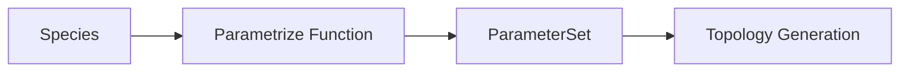

This guide explains how to add support for new force field parametrization methods in MDFactory.

<Callout type="info">
  Currently, MDFactory only supports GROMACS as an MD engine. When adding a new parametrization method, you'll implement it for GROMACS first. Support for other engines can be added later following the same patterns.
</Callout>

## Architecture overview

The parametrization system consists of three main components:



1. **Config models** (`mdfactory/models/parametrization.py`): Define configuration options
2. **Parametrize functions** (`mdfactory/parametrize.py`): Generate parameters from species
3. **Parameter sets** (`GromacsSingleMoleculeParameterSet`): Store generated parameters

## Step 1: Create a configuration model

First, define a Pydantic model for your parametrization configuration in `mdfactory/models/parametrization.py`:

```python
from pydantic import BaseModel, ConfigDict, Field

class MyForceFieldConfig(BaseModel):
    """Configuration for MyForceField parametrization."""

    model_config = ConfigDict(extra="forbid", frozen=True)

    forcefield_version: str = Field(
        "1.0",
        description="Force field version to use",
    )
    charge_method: str = Field(
        "am1bcc",
        description="Partial charge assignment method",
    )
    # Add other configuration options as needed
```

Key requirements:
- Use `extra="forbid"` to catch typos in config keys
- Use `frozen=True` for immutability (enables hashing)
- Provide sensible defaults
- Add clear descriptions

## Step 2: Update the union type

Add your config to the union type in `GromacsSingleMoleculeParameterSet`:

```python
class GromacsSingleMoleculeParameterSet(BaseModel):
    model_config = ConfigDict(extra="forbid", frozen=True)
    moleculetype: str
    smiles: str
    parametrization: Literal["cgenff", "smirnoff", "myforcefield"]  # Add here
    parametrization_config: SmirnoffConfig | CgenffConfig | MyForceFieldConfig  # Add here
    itp: AbsoluteFilePath
    parameter_itp: Optional[AbsoluteFilePath]
    forcefield_itp: Optional[AbsoluteFilePath]
```

## Step 3: Implement the parametrization function

Create the parametrization function in `mdfactory/parametrize.py`:

```python
from .models.parametrization import MyForceFieldConfig, GromacsSingleMoleculeParameterSet
from .models.species import SingleMoleculeSpecies
from typing import Optional

def parametrize_myforcefield_gromacs(
    species: SingleMoleculeSpecies,
    config: Optional[MyForceFieldConfig] = None,
) -> GromacsSingleMoleculeParameterSet:
    """
    Parametrize a molecule using MyForceField.

    Parameters
    ----------
    species : SingleMoleculeSpecies
        The molecule species to parametrize.
    config : MyForceFieldConfig, optional
        Configuration options. Uses defaults if None.

    Returns
    -------
    GromacsSingleMoleculeParameterSet
        The parameter set with paths to generated files.
    """
    # Use defaults if no config provided
    if config is None:
        config = MyForceFieldConfig()

    # Set up cache directory
    # Structure: parameter_store/gromacs/myforcefield/{version}/{mol_hash}/
    version_hash = config.forcefield_version.replace(".", "_")
    pardir = config.parameter_store / "gromacs" / "myforcefield" / version_hash
    pardir.mkdir(parents=True, exist_ok=True)

    # Handle special cases first
    if species.is_water:
        return _parametrize_water(species, config, pardir)

    if species.is_ion:
        return _parametrize_ion(species, config, pardir)

    # Regular molecule parametrization
    workdir = pardir / species.hash
    itp_path = workdir / f"{species.hash}.itp"

    # Check cache
    if itp_path.is_file():
        return GromacsSingleMoleculeParameterSet(
            moleculetype=species.hash,
            smiles=species.smiles,
            parametrization="myforcefield",
            parametrization_config=config,
            itp=itp_path.resolve(),
            parameter_itp=None,  # Set if your FF needs extra param files
            forcefield_itp=None,  # Set if your FF needs FF includes
        )

    # Generate parameters
    workdir.mkdir(parents=True, exist_ok=True)

    # Your parametrization logic here:
    # 1. Convert SMILES to 3D structure
    # 2. Assign atom types
    # 3. Calculate partial charges
    # 4. Generate bonded parameters
    # 5. Write ITP file

    _generate_itp(species, config, itp_path)

    return GromacsSingleMoleculeParameterSet(
        moleculetype=species.hash,
        smiles=species.smiles,
        parametrization="myforcefield",
        parametrization_config=config,
        itp=itp_path.resolve(),
        parameter_itp=None,
        forcefield_itp=None,
    )
```

### Handling water and ions

Always implement special handling for water and ions:

```python
def _parametrize_water(
    species: SingleMoleculeSpecies,
    config: MyForceFieldConfig,
    pardir: Path,
) -> GromacsSingleMoleculeParameterSet:
    """Handle water molecule parametrization."""
    workdir = pardir / "water"
    itp_path = workdir / "SOL.itp"

    if not itp_path.is_file():
        workdir.mkdir(parents=True, exist_ok=True)
        # Generate or copy water parameters
        _write_water_itp(config, itp_path)

    return GromacsSingleMoleculeParameterSet(
        moleculetype="SOL",  # Standard GROMACS water name
        smiles=species.smiles,
        parametrization="myforcefield",
        parametrization_config=config,
        itp=itp_path.resolve(),
        parameter_itp=None,
        forcefield_itp=None,
    )

def _parametrize_ion(
    species: SingleMoleculeSpecies,
    config: MyForceFieldConfig,
    pardir: Path,
) -> GromacsSingleMoleculeParameterSet:
    """Handle ion parametrization."""
    typemap = {"[Na+]": "NA", "[Cl-]": "CL"}
    ion_type = typemap.get(species.smiles)

    if ion_type is None:
        raise ValueError(f"Unsupported ion: {species.smiles}")

    workdir = pardir / "ions"
    itp_path = workdir / f"{ion_type}.itp"

    if not itp_path.is_file():
        workdir.mkdir(parents=True, exist_ok=True)
        _write_ion_itp(species, config, itp_path)

    return GromacsSingleMoleculeParameterSet(
        moleculetype=ion_type,
        smiles=species.smiles,
        parametrization="myforcefield",
        parametrization_config=config,
        itp=itp_path.resolve(),
        parameter_itp=None,
        forcefield_itp=None,
    )
```

## Step 4: Register the parametrization function

Add your function to the dispatch dictionary in `mdfactory/parametrize.py`:

```python
DISPATCH_ENGINE_PARAMETRIZE = {
    "gromacs": {
        "cgenff": parametrize_cgenff_gromacs,
        "smirnoff": parametrize_smirnoff_gromacs,
        "myforcefield": parametrize_myforcefield_gromacs,  # Add here
    }
}
```

## Step 5: Update BuildInput model

Update the `BuildInput` model in `mdfactory/models/input.py` to accept your config:

```python
from .parametrization import SmirnoffConfig, CgenffConfig, MyForceFieldConfig

class BuildInput(BaseModel):
    # ... existing fields ...

    parametrization: Literal["cgenff", "smirnoff", "myforcefield"] = "cgenff"
    parametrization_config: SmirnoffConfig | CgenffConfig | MyForceFieldConfig | None = Field(
        None,
        description="Force field configuration. Auto-set based on parametrization if not provided.",
    )

    @model_validator(mode="after")
    def set_default_config(self) -> "BuildInput":
        if self.parametrization_config is None:
            if self.parametrization == "smirnoff":
                object.__setattr__(self, "parametrization_config", SmirnoffConfig())
            elif self.parametrization == "cgenff":
                object.__setattr__(self, "parametrization_config", CgenffConfig())
            elif self.parametrization == "myforcefield":
                object.__setattr__(self, "parametrization_config", MyForceFieldConfig())
        return self
```

## Step 6: Update build.py

Update the `_get_parametrize_function` helper in `mdfactory/build.py`:

```python
def _get_parametrize_function(engine: str, parametrization: str, config):
    """Get parametrization function, wrapping with config if needed."""
    base_func = DISPATCH_ENGINE_PARAMETRIZE[engine][parametrization]

    if parametrization == "smirnoff" and isinstance(config, SmirnoffConfig):
        return functools.partial(base_func, smirnoff_config=config)
    elif parametrization == "myforcefield" and isinstance(config, MyForceFieldConfig):
        return functools.partial(base_func, config=config)

    return base_func
```

## Step 7: Write tests

Create tests in `mdfactory/tests/test_parametrization.py`:

```python
import pytest
from pathlib import Path
from mdfactory.models.species import SingleMoleculeSpecies
from mdfactory.models.parametrization import MyForceFieldConfig
from mdfactory.parametrize import parametrize_myforcefield_gromacs

@pytest.fixture
def temp_parameter_store(tmp_path, monkeypatch):
    """Set up temporary parameter store."""
    from mdfactory import config
    monkeypatch.setattr(config, "parameter_store", tmp_path)
    return tmp_path

def test_myforcefield_simple_molecule(temp_parameter_store):
    """Test parametrization of a simple molecule."""
    species = SingleMoleculeSpecies(smiles="CCO", resname="ETH", count=1)
    params = parametrize_myforcefield_gromacs(species)

    assert params.parametrization == "myforcefield"
    assert params.itp.is_file()
    assert params.smiles == "CCO"

def test_myforcefield_water(temp_parameter_store):
    """Test water parametrization."""
    species = SingleMoleculeSpecies(smiles="O", resname="SOL", count=1)
    params = parametrize_myforcefield_gromacs(species)

    assert params.moleculetype == "SOL"
    assert params.itp.is_file()

def test_myforcefield_with_config(temp_parameter_store):
    """Test parametrization with custom config."""
    config = MyForceFieldConfig(forcefield_version="2.0")
    species = SingleMoleculeSpecies(smiles="CCO", resname="ETH", count=1)
    params = parametrize_myforcefield_gromacs(species, config=config)

    assert params.parametrization_config.forcefield_version == "2.0"

def test_myforcefield_caching(temp_parameter_store):
    """Test that parameters are cached correctly."""
    species = SingleMoleculeSpecies(smiles="CCO", resname="ETH", count=1)

    # First call generates
    params1 = parametrize_myforcefield_gromacs(species)
    mtime1 = params1.itp.stat().st_mtime

    # Second call should use cache
    params2 = parametrize_myforcefield_gromacs(species)
    mtime2 = params2.itp.stat().st_mtime

    assert mtime1 == mtime2  # File not regenerated
```

## Step 8: Update dependencies

If your parametrization requires new dependencies, add them to `environment.yml`:

```yaml
dependencies:
  - python>=3.10
  - pydantic>=2.0
  # ... existing deps ...
  - my-forcefield-package  # Add your dependency
```

## File structure summary

After implementing a new parametrization method, you should have modified:

```
mdfactory/
├── models/
│   ├── parametrization.py  # Add MyForceFieldConfig
│   └── input.py            # Update BuildInput
├── parametrize.py          # Add parametrize_myforcefield_gromacs
├── build.py                # Update _get_parametrize_function
└── tests/
    └── test_parametrization.py  # Add tests
```

## Checklist

Before submitting a PR for a new parametrization method:

- [ ] Configuration model with sensible defaults
- [ ] Parametrization function handles water and ions
- [ ] Parameter caching implemented
- [ ] Config stored in `GromacsSingleMoleculeParameterSet`
- [ ] Registered in `DISPATCH_ENGINE_PARAMETRIZE`
- [ ] `BuildInput` model updated
- [ ] Tests for simple molecules, water, ions, and caching
- [ ] Dependencies added to `environment.yml`
- [ ] Documentation updated

## Example: GAFF parametrization

Here's a sketch of how you might implement GAFF (General AMBER Force Field) support:

```python
class GaffConfig(BaseModel):
    """Configuration for GAFF parametrization."""

    model_config = ConfigDict(extra="forbid", frozen=True)

    gaff_version: Literal["gaff", "gaff2"] = Field(
        "gaff2",
        description="GAFF version (gaff or gaff2)",
    )
    charge_method: str = Field(
        "am1bcc",
        description="Charge method for antechamber",
    )

def parametrize_gaff_gromacs(
    species: SingleMoleculeSpecies,
    config: Optional[GaffConfig] = None,
) -> GromacsSingleMoleculeParameterSet:
    """Parametrize using GAFF via AmberTools."""
    if config is None:
        config = GaffConfig()

    # Use antechamber for atom typing and charges
    # Use parmchk2 for missing parameters
    # Use acpype or ParmEd for GROMACS conversion
    ...
```

## Next steps

<Cards>
  <Card title="Architecture" href="/docs/developer-guide/architecture" />
  <Card title="Extending Engines" href="/docs/developer-guide/extending-engines" />
  <Card title="Testing" href="/docs/developer-guide/testing" />
</Cards>
