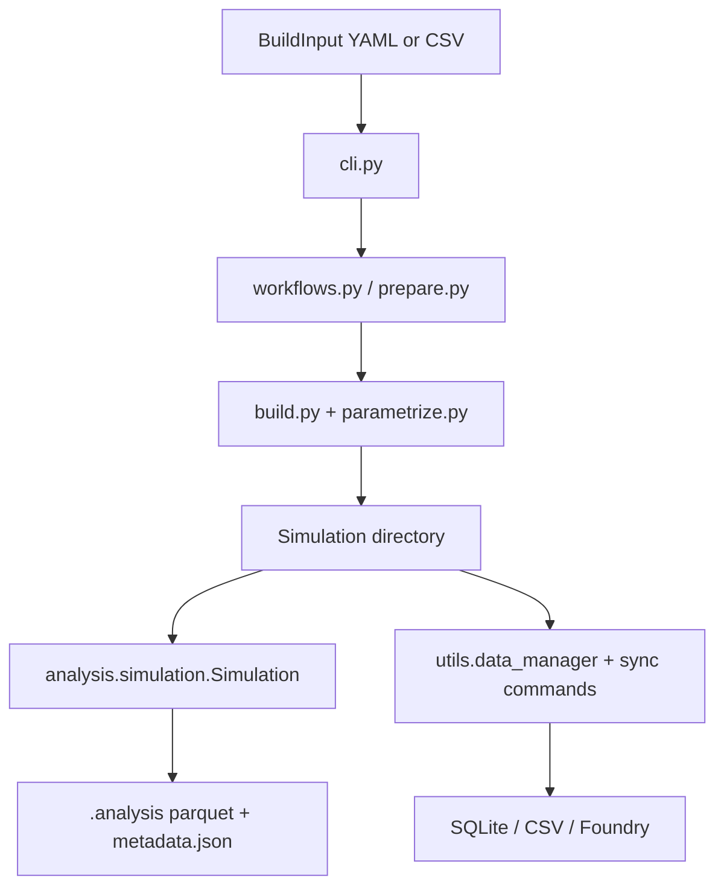
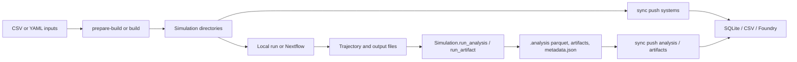

MDFactory is not a single-pattern codebase. The current implementation combines:

- Pydantic models for validated simulation inputs
- function dispatch for build, parametrization, analysis, and artifact registration
- stateful helper classes for per-simulation analysis storage and multi-backend sync

## High-level structure



## End-to-end lifecycle



## Build subsystem

### Input models

`mdfactory.models.input.BuildInput` is the top-level validated input model. It uses `simulation_type` to cast the `system` field to the correct composition model:

- `mixedbox -> MixedBoxComposition`
- `bilayer -> BilayerComposition`
- `lnp -> LNPComposition`

The current `engine` model field is restricted to `gromacs`.

### Build dispatch

`mdfactory/workflows.py` dispatches by simulation type:

```python
DISPATCH_BUILD = {
    "mixedbox": build_mixedbox,
    "bilayer": build_bilayer,
    "lnp": build_lnp,
}
```

Inside the build functions, parametrization and topology generation are dispatched again from `mdfactory/parametrize.py`.

### Output conventions

The builders write simulation files directly into the working directory, including:

- `system.pdb`
- `topology.top`
- GROMACS `.mdp` files copied from the configured run schedule templates

## Analysis and artifact subsystem

The analysis stack revolves around three concrete classes:

- `Simulation`: one simulation directory plus execution helpers
- `AnalysisRegistry`: reads and writes `.analysis/metadata.json`
- `SimulationStore`: discovery, status aggregation, and batch execution across many simulations

### Registered analyses

`ANALYSIS_REGISTRY` is currently defined for:

- `bilayer`
- `mixedbox`

`system_chemistry` is injected into every simulation type that is present in that registry. At the moment, that means `bilayer` and `mixedbox`, not `lnp`.

### Registered artifacts

`ARTIFACT_REGISTRY` is currently defined for:

- `bilayer`
- `mixedbox`

`bilayer` has the richer artifact set. `mixedbox` currently exposes `last_frame_pdb`.

### Storage model

Per simulation:

- analysis tables are saved as `.analysis/<analysis_name>.parquet`
- artifact files are moved under `.analysis/artifacts/<artifact_name>/`
- registry metadata lives in `.analysis/metadata.json`

`Simulation.run_analysis()` executes the registered function, filters unsupported keyword arguments, saves the parquet file, and updates the registry.

`Simulation.run_artifact()` executes the registered producer, moves the files into the artifact directory, computes checksums, and records them in the registry.

### Batch and SLURM execution

`SimulationStore` provides:

- discovery
- list status
- remove analyses or artifacts
- batch execution helpers

`mdfactory.analysis.submit` adds:

- local cross-simulation execution helpers
- submitit-backed SLURM submission
- hash filtering and path resolution utilities

## Sync and backend subsystem

The sync layer is class-based rather than pure dispatch.

### Configuration

`mdfactory.utils.data_manager.Config` loads:

1. default values baked into the code
2. `config_templates/config.ini`
3. `~/.mdfactory/config.ini` if present

### Data access layer

`DataManager` selects the active backend and delegates to a backend-specific class:

- `SQLiteDataSource`
- `CsvDataSource`
- `FoundryDataSource`

This is where the codebase does use abstract base classes: `DataSource` defines the backend contract.

### Backend layout

The current sync commands support three backends:

- SQLite
- CSV
- Foundry

For analysis and artifact sync, the code uses:

- one overview table or dataset: `ANALYSIS_OVERVIEW`
- one per-analysis table or dataset: `ANALYSIS_<NAME>`
- one per-artifact table or dataset: `ARTIFACT_<NAME>`

## Workflow orchestration

The repository contains Nextflow scripts under `workflows/`. The scripts that most directly align with the current CLI are:

- `build.nf`
- `simulate.nf`

These scripts wrap the checked-in `mdfactory prepare-build` and `mdfactory build` commands plus a fixed GROMACS run chain.

## Extension points

- New simulation type: add the composition model, build function, and build dispatch entry.
- New parametrization method: add the config model and parametrization dispatch entry.
- New analysis or artifact: implement the function and register it in the relevant registry.
- New sync backend: implement the `DataSource` contract and wire it through `DataManager`.

## Next steps

<Cards>
  <Card title="Adding Analyses and Artifacts" href="/docs/developer-guide/adding-analyses-artifacts" />
  <Card title="Foundry Dev Tools" href="/docs/user-guide/foundry-dev-tools" />
  <Card title="AI Development" href="/docs/developer-guide/ai-development" />
</Cards>
