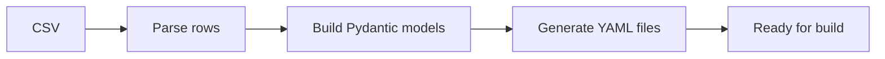

Use CSV files to define multiple simulation systems at once. Each row becomes a separate `BuildInput` YAML file via `mdfactory prepare-build`.

## Basic structure

```csv
simulation_type,parametrization,engine,system.species.SOL.smiles,system.species.SOL.count,system.species.ETH.smiles,system.species.ETH.count,system.target_density
mixedbox,smirnoff,gromacs,O,900,CCO,100,1.0
mixedbox,cgenff,gromacs,O,800,CCO,200,1.0
```

### Required columns

- `simulation_type` (`mixedbox`, `bilayer`, or `lnp`)
- `parametrization` (`smirnoff` or `cgenff`)
- `engine` (`gromacs`)

### Column naming convention

Columns map to the nested `BuildInput` YAML structure using dot notation:

```
system.species.{RESNAME}.{property}
```

For example:
- `system.species.SOL.smiles` → the SMILES string for a species with resname SOL
- `system.species.SOL.count` → the count for that species
- `system.species.SOL.fraction` → the molar fraction for that species
- `system.target_density` → the target density for a mixedbox system

## Species specification

Define molecules using the pattern `system.species.{RESNAME}.{property}`:

| Property | Type | Description |
|----------|------|-------------|
| `smiles` | string | SMILES structure |
| `count` | integer | Absolute molecule count |
| `fraction` | float | Molar fraction (0-1) |

Either `count` or `fraction` must be provided for each species. If using fractions, `system.total_count` specifies the total number of molecules.

## Example: Mixed box with multiple components

```csv
simulation_type,parametrization,engine,system.species.SOL.smiles,system.species.SOL.fraction,system.species.ETH.smiles,system.species.ETH.count,system.total_count,system.target_density
mixedbox,smirnoff,gromacs,O,0.95,CCO,500,10000,1.0
```

## Example: Bilayer

```csv
simulation_type,parametrization,engine,system.species.POPC.smiles,system.species.POPC.count,system.z_padding
bilayer,cgenff,gromacs,POPC_SMILES_HERE,128,20.0
```

## Example: LNP

For LNP systems, core and shell species use separate column prefixes:

```csv
simulation_type,parametrization,engine,system.radius,system.shell_thickness,system.core.species.ILN.smiles,system.core.species.ILN.fraction,system.shell.species.DSP.smiles,system.shell.species.DSP.fraction
lnp,smirnoff,gromacs,60.0,28.0,ILN_SMILES,0.5,DSP_SMILES,0.5
```

## Processing the CSV

Convert CSV to individual system directories:

```bash
mdfactory prepare-build sample_input.csv output_systems
```

Each row generates a directory named by the system's hash, containing the `BuildInput` YAML file.

### Validation

Check that a CSV is valid without building:

```bash
mdfactory check-csv sample_input.csv
```

This parses every row into a `BuildInput` model and reports validation errors.

### Conversion flow



## Column reference

### Top-level settings

| Column | Type | Required | Description |
|--------|------|----------|-------------|
| `simulation_type` | string | Yes | `mixedbox`, `bilayer`, or `lnp` |
| `parametrization` | string | Yes | `smirnoff` or `cgenff` |
| `engine` | string | Yes | `gromacs` |

### System fields

These map directly to `BuildInput.system` fields using dot notation:

| Column | Type | Description |
|--------|------|-------------|
| `system.total_count` | integer | Total molecule count (for use with fractions) |
| `system.target_density` | float | Target density in g/cm³ (mixedbox) |
| `system.z_padding` | float | Water padding in Å (bilayer) |
| `system.monolayer` | bool | Build monolayer (bilayer) |
| `system.radius` | float | LNP radius in Å |
| `system.shell_thickness` | float | Shell thickness in Å |
| `system.padding` | float | Water padding in Å (LNP) |
| `system.core.target_density` | float | Core density in g/cm³ (LNP) |
| `system.shell.z0` | float | Pivotal plane offset in Å (LNP) |
| `system.shell.area_per_lipid` | float | Area per lipid in Ų (LNP) |

### Parametrization config (optional)

| Column | Type | Description |
|--------|------|-------------|
| `parametrization_config.forcefield` | string | OpenFF force field file (SMIRNOFF) |
| `parametrization_config.water_model` | string | Water model file (SMIRNOFF) |
| `parametrization_config.charge_method` | string | Charge assignment method (SMIRNOFF) |

<Callout type="warn">
  Invalid SMILES strings will cause parametrization to fail. Use `mdfactory check-csv` to validate before building.
</Callout>

## Next steps

<Cards>
  <Card title="Quick Start" href="/docs/quick-start" />
  <Card title="System Types" href="/docs/user-guide/system-types" />
  <Card title="Workflows" href="/docs/user-guide/workflows" />
</Cards>
