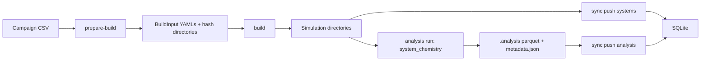

This tutorial walks through an end-to-end example for **20 different `mixedbox` systems** using only workflows that exist in the current codebase.

The campaign varies **alcohol chain length** and composition at the same time:

- methanol
- ethanol
- 1-propanol
- 1-butanol
- 1-pentanol

For each alcohol, the tutorial uses four solvent fractions. That gives a total of 20 systems while keeping the setup easy to inspect.

1. prepare 20 systems from one CSV
2. build all simulation directories
3. optionally run the checked-in GROMACS Nextflow workflow
4. run the current mixed-box analysis
5. push systems and analysis results into SQLite
6. pull the data back out
7. aggregate and plot it in a notebook with the Python API

<Callout type="info">
  In the current codebase, `mixedbox` exposes one registered analysis: `system_chemistry`. That analysis reads from the validated `BuildInput` metadata and does not require a trajectory. This makes it a good tutorial target for an end-to-end setup, analysis, and sync workflow.
</Callout>

## Files already in the repository

Reference mixed-box YAML examples already exist in:

- `examples/mixedbox/water_ethanol_smirnoff.yaml`
- `examples/mixedbox/water_ethanol_cgenff.yaml`

This tutorial adds a larger CSV-style campaign example. The full 20-system input file is available here:

- [`/tutorials/mixedbox_chain_length_series_20.csv`](/tutorials/mixedbox_chain_length_series_20.csv)

## Campaign design

The example campaign holds these settings fixed:

- `simulation_type: mixedbox`
- `engine: gromacs`
- `parametrization: smirnoff`
- `system.total_count: 2000`
- `system.target_density: 1.0`

The campaign varies:

- alcohol identity through SMILES
- alcohol residue name
- alcohol fraction in water

The 20 systems are a 5 x 4 grid:

- 5 alcohols: methanol, ethanol, 1-propanol, 1-butanol, 1-pentanol
- 4 fractions: 0.05, 0.15, 0.25, 0.35

First few rows:

```csv
simulation_type,parametrization,engine,system.species.SOL.smiles,system.species.SOL.fraction,system.species.MEOH.smiles,system.species.MEOH.fraction,system.total_count,system.target_density
mixedbox,smirnoff,gromacs,O,0.95,CO,0.05,2000,1.0
mixedbox,smirnoff,gromacs,O,0.85,CO,0.15,2000,1.0
mixedbox,smirnoff,gromacs,O,0.75,CO,0.25,2000,1.0
mixedbox,smirnoff,gromacs,O,0.65,CO,0.35,2000,1.0
mixedbox,smirnoff,gromacs,O,0.95,CCO,0.05,2000,1.0
```

## 1. Configure SQLite

Initialize config with the wizard:

```bash
mdfactory config init
```

For this tutorial, choose the `sqlite` backend. You can verify the active config path with:

```bash
mdfactory config path
```

Your config should include SQLite paths similar to:

```ini
[database]
TYPE = sqlite

[sqlite]
RUN_DB_PATH = <platform data dir>/runs.db
ANALYSIS_DB_PATH = <platform data dir>/analysis.db
```

## 2. Prepare the 20 build directories

```bash
mkdir -p tutorial_campaign

mdfactory prepare-build \
  docs/public/tutorials/mixedbox_chain_length_series_20.csv \
  tutorial_campaign
```

This creates:

- one hash directory per row
- one summary YAML named after the CSV stem

For this tutorial, the summary YAML will be:

```text
tutorial_campaign/mixedbox_chain_length_series_20.yaml
```

## 3. Build all 20 systems

One simple local loop is:

```bash
for yml in tutorial_campaign/*/*.yaml; do
  mdfactory build "$yml" "$(dirname "$yml")"
done
```

After this step, each hash directory should contain the standard build outputs such as:

- `system.pdb`
- `topology.top`
- `em.mdp`
- `nvt.mdp`
- `npt.mdp`
- `md.mdp`

## 4. Optional: run the checked-in GROMACS workflow

If you want to continue through a full simulation campaign, use the stage-2 Nextflow workflow:

```bash
nextflow run workflows/simulate.nf \
  -c workflows/simulate.config \
  --base_dir tutorial_campaign \
  --config_yaml tutorial_campaign/mixedbox_chain_length_series_20.yaml
```

This executes the fixed sequence implemented in `workflows/simulate.nf`:

1. minimization
2. NVT equilibration
3. NPT equilibration
4. production

<Callout type="info">
  You do not need to finish the MD run to continue with the analysis example below, because `system_chemistry` does not require a trajectory.
</Callout>

## 5. Run the current mixed-box analysis

Run the registered mixed-box analysis on the full campaign:

```bash
mdfactory analysis run \
  tutorial_campaign/mixedbox_chain_length_series_20.yaml \
  --analysis system_chemistry
```

Inspect status:

```bash
mdfactory analysis info tutorial_campaign/mixedbox_chain_length_series_20.yaml
```

The analysis output is written per simulation under:

```text
.analysis/system_chemistry.parquet
```

## 6. Initialize the SQLite sync tables

```bash
mdfactory sync init systems
mdfactory sync init analysis
mdfactory sync init artifacts
```

For this tutorial, the important tables are the run database and the analysis tables.

## 7. Push systems and analysis into SQLite

Push the system metadata:

```bash
mdfactory sync push systems tutorial_campaign/mixedbox_chain_length_series_20.yaml
```

Push the `system_chemistry` analysis:

```bash
mdfactory sync push analysis \
  tutorial_campaign/mixedbox_chain_length_series_20.yaml \
  --analysis-name system_chemistry
```

## 8. Pull the results back out

Pull the system summary:

```bash
mdfactory sync pull systems \
  --simulation-type mixedbox \
  --output tutorial_systems.csv
```

Pull the analysis table:

```bash
mdfactory sync pull analysis \
  --analysis-name system_chemistry \
  --simulation-type mixedbox \
  --output tutorial_system_chemistry.csv
```

See the analysis overview table:

```bash
mdfactory sync pull analysis --overview
```

## 9. Aggregate the campaign in a notebook

If you completed the simulation run step, each directory should now include `prod.xtc`, so the campaign can be discovered directly with `SimulationStore`.

### Notebook cell: load and join analysis data

```python
import matplotlib.pyplot as plt
import pandas as pd

from mdfactory.analysis.store import SimulationStore
from mdfactory.analysis.utils import flatten_system_parameters

store = SimulationStore("tutorial_campaign")
store.discover()

chemistry = store.load_analysis_with_metadata(
    "system_chemistry",
    flatten_fn=flatten_system_parameters,
    missing_ok=True,
)

chemistry.head()
```

This gives you:

- one row per species per simulation from `system_chemistry`
- the simulation hash
- flattened metadata such as `simulation_type`, `engine`, `parametrization`, and `target_density`

### Notebook cell: annotate alcohol chain length

```python
chain_length = {
    "MEOH": 1,
    "ETH": 2,
    "PRO": 3,
    "BUT": 4,
    "PEN": 5,
}

alcohols = chemistry[chemistry["resname"] != "SOL"].copy()
alcohols["chain_length"] = alcohols["resname"].map(chain_length)

alcohols[["hash", "resname", "chain_length", "count", "fraction"]].head()
```

### Notebook cell: plot count versus fraction by chain length

```python
fig, ax = plt.subplots(figsize=(7, 4))

for chain_len, frame in alcohols.groupby("chain_length"):
    frame = frame.sort_values("fraction")
    ax.plot(
        frame["fraction"],
        frame["count"],
        marker="o",
        label=f"C{chain_len} alcohol",
    )

ax.set_xlabel("Alcohol mole fraction")
ax.set_ylabel("Alcohol count")
ax.set_title("20-system water/alcohol chain-length campaign")
ax.legend()
plt.tight_layout()
plt.show()
```

### Alternative notebook path: work from the pulled SQLite CSV

If you skipped the simulation run and only want to work from the synchronized analysis export:

```python
import matplotlib.pyplot as plt
import pandas as pd

chemistry = pd.read_csv("tutorial_system_chemistry.csv")
chain_length = {
    "MEOH": 1,
    "ETH": 2,
    "PRO": 3,
    "BUT": 4,
    "PEN": 5,
}

alcohols = chemistry[chemistry["resname"] != "SOL"].copy()
alcohols["chain_length"] = alcohols["resname"].map(chain_length)

fig, ax = plt.subplots(figsize=(7, 4))
for chain_len, frame in alcohols.groupby("chain_length"):
    frame = frame.sort_values("fraction")
    ax.plot(frame["fraction"], frame["count"], marker="o", label=f"C{chain_len}")

ax.set_xlabel("Alcohol mole fraction")
ax.set_ylabel("Alcohol count")
ax.set_title("20-system water/alcohol chain-length campaign")
ax.legend(title="Series")
plt.tight_layout()
plt.show()
```

## Where this fits in the architecture

This tutorial exercises the main architectural layers:



Concretely:

- build input validation is handled by `BuildInput` and the composition models
- system construction is dispatched from `workflows.py` into `build.py`
- analysis execution and local storage run through `Simulation`
- push and pull flows use the configured backend through `DataManager`

For the broader code structure, see [Architecture](/docs/developer-guide/architecture).

## Next steps

<Cards>
  <Card title="CSV Format" href="/docs/user-guide/csv-format" />
  <Card title="Executing Analyses" href="/docs/user-guide/executing-analyses" />
  <Card title="Architecture" href="/docs/developer-guide/architecture" />
</Cards>
